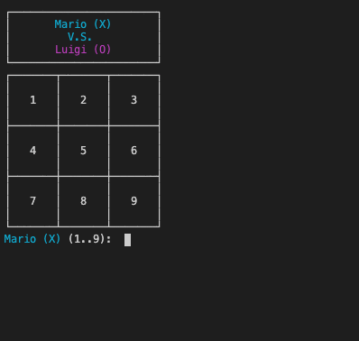

# Tic-Tac-Toe

Tic-Tac-Toe game implemented in Ruby.

## Playing the game

- Clone the repository.
- Open a terminal on the containing folder of this project
- `bundle install`
- `ruby bin/main.rb`

## Authors

👤 **Emanuel Gozalez**

- Github: [@emasdev](https://github.com/emasdev)

👤 **Osama Aldemeery**

- Github: [@aldemeery](https://github.com/aldemeery)
- Twitter: [@aldemeery](https://twitter.com/aldemeery)
- Linkedin: [osamaaldemeery](https://linkedin.com/in/osamaaldemeery)

## RULES FOR TIC-TAC-TOE

1. The game is played on a grid that's 3 squares by 3 squares.

2. You are X, your friend is O. Players take turns putting their marks in empty squares.

3. The first player to get 3 of her marks in a row (up, down, across, or diagonally) is the winner.

4. When all squares are full, the game is over. If no player has 3 marks in a row, the game ends in a tie.

Note: You can play also with a more than 3 by 3 squares dimension, with the vary that your with will be n by n.
If a player has n marks in a row, is the winner. If all squaares are full and no player has n marks in a row
the game ends and is a tie.

## INSTRUCTIONS TO PLAY

1. Select 'Play a new game' option.

2. Writte first (X) and second (O) player's name.

3. Choose a number from the grid to mark it with the player's symbol,
   then is turn of the next player to do the same.

4. If a player gets 3 symbols in a row (up, down, across, or diagonally) is the winner.
   If all squares are full and none has the 3 symbols the game ends in a tie.

Optional(secret): You can play also with a more than 3 by 3 squares dimension, with the vary that your with will be n by n.
If a player has n marks in a row, is the winner. If all squaares are full and no player has n marks in a row
the game ends and is a tie.

## TRICKS & SECRETS

Do you wanna feel like a hacker? try to change the dimension variable of the board area in the main.rb file
and get a more intense experience.

## Contributing

Bug reports and pull requests are welcome on GitHub at https://github.com/aldemeery/tic-tac-toe.

## License

The gem is available as open source under the terms of the [MIT License](https://opensource.org/licenses/MIT).
